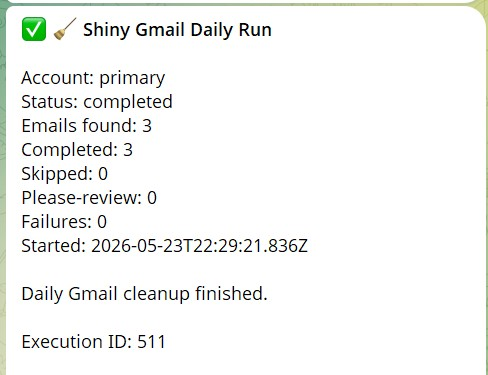

<div align="center">

# ✨ Shiny Gmail Automation

**Wake up to a cleaner Gmail inbox — every morning.**

[](https://github.com/chanrylejay/shiny-gmail-automation)
[](workflows)
[](workflows)
[](LICENSE)
[](https://github.com/chanrylejay/shiny-gmail-automation)

**Shiny Gmail Automation** is a personal inbox-cleaning system built on [n8n](https://n8n.io) that sorts new Gmail messages using AI, applies helpful labels, lets you manage sender rules from Telegram, and sends you a short daily summary — all while you sleep.

No monthly subscription. No complicated dashboard. No need to manually clean your inbox every day.

[What It Does](#-what-it-does) · [The Simple Version](#-the-simple-version) · [Quick Start](#-quick-start) · [Safety & Privacy](#-safety--privacy) · [Telegram Commands](#-telegram-commands) · [FAQ](#-faq)

</div>

---

## 📸 Telegram Daily Summary

Every morning, your Telegram bot sends you a clean report of what happened overnight:

<div align="center">
  
</div>

<br>

> **What you're seeing:** The bot reports how many emails were found, how many were classified, whether anything failed, whether anything needs review, and whether more emails may still be waiting in the inbox.

---

## 🤔 What It Does

Shiny Gmail Automation checks your new Gmail messages once a day and organizes them for you.

Every morning, it can:

- 🔴 Highlight real human conversations and important replies as **priority**
- 💰 Label receipts, orders, billing, invoices, payments, refunds, and financial records as **finances**
- 🔔 Tag service updates, subscriptions, platform notices, app alerts, and automation monitoring emails as **accounts-subscriptions**
- 🔐 Label OTPs, verification codes, sign-in alerts, password resets, and suspicious activity emails as **account-security**
- 🗑 Mark newsletters, promotions, coupons, cold outreach, and clutter as **unimportant**
- 🔎 Set unclear or ambiguous messages aside as **needs-review**
- 📲 Send you a Telegram summary of what happened

Instead of opening Gmail to a messy inbox, you wake up to something already sorted.

---

## 👤 Who This Is For

This project is for you if:

- You receive a manageable number of personal emails each day
- You want Gmail to feel less messy
- You like the idea of controlling sender and domain rules from Telegram
- You are comfortable following a setup guide once
- You want a free, self-hosted automation instead of another paid app

This project is probably **not** for you if:

- You want a one-click mobile app
- You do not want to set up n8n, Gmail API access, Telegram, Gemini, and a database
- You need enterprise email compliance features
- You want the system to delete emails automatically

> Shiny Gmail Automation is designed to **organize**, not destroy. It labels and archives emails. It does not permanently delete your inbox.

---

## ☕ The Simple Version

Imagine this:

You sleep.

At 6:00 AM, Shiny Gmail checks your new emails.

It sees:

- An Amazon order confirmation
- A bank sign-in alert
- A random newsletter
- A work email
- One confusing email it's not sure about

Then it labels them:

| Email | Label |
|---|---|
| Amazon order | `finances` |
| Bank sign-in alert | `account-security` |
| Newsletter | `unimportant` |
| Work email | `priority` |
| Confusing email | `needs-review` |

Then it sends you a Telegram message:

```text
🧹 Shiny Gmail Daily Run

5 emails processed
🔴 priority: 1
💰 finances: 1
🔐 account-security: 1
🗑 unimportant: 1
🔎 needs-review: 1
```

You open Gmail only when something actually needs your attention.

---

## 🏷️ Gmail Labels Used

Shiny Gmail V4.0 uses seven Gmail labels:

| Label | Meaning |
|---|---|
| `priority` | Human conversations, important replies, or messages that may need personal attention |
| `finances` | Receipts, orders, invoices, billing, payments, refunds, statements, tax, payroll, and money records |
| `accounts-subscriptions` | Platform notices, service updates, subscriptions, app alerts, automation monitoring, quotas, and non-security account messages |
| `account-security` | OTPs, login alerts, verification codes, password resets, suspicious activity, and account safety messages |
| `unimportant` | Newsletters, promos, marketing, coupons, surveys, cold outreach, and spam-like clutter |
| `needs-review` | Messages the system is unsure about or does not want to guess silently |
| `processed` | A "done" stamp showing the email was already handled |

The most important idea:

> `needs-review` is the safety net. If the system is unsure, it asks you instead of guessing silently.

> [!WARNING]
> Do not create a Gmail label named `important`. Gmail reserves that name as a system label. This project uses `priority` instead.

---

## ⚡ How It Works

```text
Every morning at 6:00 AM Asia/Manila

Gmail inbox
   ↓
Find new unprocessed emails
   ↓
Check your Telegram sender/domain rules
   ↓
Reuse safe ledger/thread history when possible
   ↓
If no safe shortcut exists → ask Gemini AI to classify
   ↓
Apply the right Gmail label
   ↓
Add the processed label
   ↓
Archive the email
   ↓
Send you a Telegram summary
```

The system is made of three n8n workflows:

| Workflow | What It Does |
|---|---|
| **Workflow A** — Daily Orchestrator | Finds new emails, batches them safely, calls the child workflow, and sends the daily summary |
| **Workflow B** — Email Processor | Classifies and labels one email at a time |
| **Workflow C** — Telegram Rules Manager | Lets you add, remove, inspect, and explain rules from Telegram |

### Architecture

```text
┌─────────────┐
│    Gmail    │
└──────┬──────┘
       │
       ▼
┌─────────────┐
│     n8n     │
└──────┬──────┘
       │
       ├──────────────► Gemini AI
       │                  │
       │                  ▼
       │              Classification
       │
       ├──────────────► Postgres
       │                  │
       │                  ▼
       │              Rules + audit ledger
       │
       └──────────────► Telegram Bot
                          │
                          ▼
                    Summary + commands
```

---

## 📱 Telegram Commands

You do not need to open n8n every time you want to change a rule. Just message your Telegram bot.

### Examples

Always mark this sender as priority:

```text
/whitelist boss@company.com
```

Always mark this sender as unimportant:

```text
/blacklist annoying@newsletter.com
```

Always mark this sender as finances:

```text
/receipt orders@store.com
```

Always send this sender to needs-review:

```text
/review weird@example.com
```

You can also manage whole domains:

```text
/whitelistdomain company.com
/blacklistdomain spammy-site.com
/receiptdomain billingvendor.com
/reviewdomain ambiguousvendor.com
```

Domain rules also catch subdomains. For example, `/blacklistdomain spammy-site.com` also catches `news.spammy-site.com`, `mail.spammy-site.com`, and `offers.spammy-site.com`.

### Full Command Reference

#### Add Sender Rules

```text
/whitelist mail@example.com
/blacklist mail@example.com
/receipt mail@example.com
/review mail@example.com
```

#### Add Domain Rules

```text
/whitelistdomain example.com
/blacklistdomain example.com
/receiptdomain example.com
/reviewdomain example.com
```

#### Remove Sender Rules

```text
/unwhitelist mail@example.com
/unblacklist mail@example.com
/unreceipt mail@example.com
/unreview mail@example.com
```

#### Remove Domain Rules

```text
/unwhitelistdomain example.com
/unblacklistdomain example.com
/unreceiptdomain example.com
/unreviewdomain example.com
```

#### Inspect and Explain

```text
/help
/rules
/rules finances
/rules domain
/rules disabled
/rules all
/stats
/stats 30
/recent
/recent failed
/recent warnings
/recent needs-review 10
/recent sender@example.com 5
/recent example.com 10
/explain sender@example.com
```

### Useful Inspection Commands

| Command | What It Does |
|---|---|
| `/rules` | Lists enabled sender/domain rules |
| `/rules disabled` | Shows disabled rules |
| `/rules all` | Shows enabled and disabled rules |
| `/stats [days]` | Shows recent classification stats and AI bypass rate |
| `/recent` | Shows recently processed emails |
| `/recent failed` | Shows failed processing attempts |
| `/recent warnings` | Shows completed emails that had warnings, such as archive warnings |
| `/explain sender@example.com` | Explains which rule/history would affect a sender or domain |

---

## 🔒 Safety & Privacy

Shiny Gmail Automation is designed to be careful.

### It does not delete emails

The system labels messages and removes them from the inbox after processing. It does not permanently delete your mail.

### It does not send emails

This automation is for sorting and labeling. It is not designed to reply to people or send messages from your Gmail account.

### Your rules beat AI

If you create a rule, that rule wins.

For example:

```text
/whitelist boss@company.com
```

…means emails from that sender are treated as priority — even if AI would have guessed something else.

### If AI is unsure, the email goes to review

If Gemini fails, times out, returns something invalid, has low confidence, or cannot classify safely, the message goes to `needs-review`. That means you stay in control.

### It only uses lightweight email information

The workflow is designed around email metadata:

- Sender
- To / CC context
- Subject
- Date
- Gmail snippet (a short preview provided by Gmail)

> Avoid using this project if you are uncomfortable with an AI classifier seeing preview text from your emails.

### Email metadata is treated as untrusted

The Gemini prompt explicitly treats email metadata as untrusted external data. This helps reduce prompt-injection risk from malicious subjects or snippets.

### Gmail labels are the source of truth

The `processed` label tells the system an email has already been handled. If an email does not get processed because something failed, it stays available for the next run.

### Credentials stay in your own tools

Your Gmail, Telegram, Gemini, and database credentials are configured inside your own n8n instance. Do not commit real credentials, tokens, or API keys to this repository.

---

## 🧰 What You Need Before Setup

You will need accounts or access for:

- **Gmail** — the inbox you want to organize
- **n8n** (self-hosted) — runs the automation workflows
- **Telegram** — for rule management and daily summaries
- **Google AI Studio / Gemini API** — for AI email classification
- **Neon Postgres** (or another Postgres database) — stores rules and audit logs
- **ngrok** (or another HTTPS tunnel) — for Telegram webhooks if you self-host locally

> [!NOTE]
> Telegram webhooks require HTTPS. If you run n8n locally on `http://localhost`, you need an HTTPS tunnel like ngrok. The free tier is enough for personal use.

> [!NOTE]
> Gemini model availability and free tier quotas vary by region and account. If one model returns `429` errors, try a different model. See the [Deployment Guide](docs/deployment-guide.md#troubleshooting) for details.

---

## 🚀 Quick Start

This is the short version. For full step-by-step instructions, read the **[Deployment Guide](docs/deployment-guide.md)**.

### Step 1 — Create Gmail Labels

In Gmail, create these labels:

```text
priority
finances
accounts-subscriptions
account-security
unimportant
needs-review
processed
```

### Step 2 — Create Your Database

Run the schema file in your Postgres database:

```text
database/schema.sql
```

For a brand-new setup, use the V4.0 schema. If you are upgrading from an older version and want to preserve data, use the migration script instead.

### Step 3 — Set Up HTTPS Tunnel

Set up ngrok or another HTTPS tunnel so Telegram can reach your local n8n instance.

### Step 4 — Import the n8n Workflows

Import the workflows in this order:

1. `workflow_b_email_processor.json`
2. `workflow_c_rules_manager.json`
3. `workflow_a_orchestrator.json`

### Step 5 — Connect Credentials

Connect or configure credentials for Gmail, Gemini, Telegram, and Postgres.

### Step 6 — Replace Placeholder IDs

After importing Workflow B, copy its workflow ID. Then paste it into Workflow A's **Call Single Email Processor** node.

Also replace any placeholder credential references, URLs, or webhook paths required by your local setup.

### Step 7 — Run Smoke Tests

Before activating the workflows, run test cases for:

- One normal human email
- One newsletter or promo email
- One receipt/order email
- One login or OTP email
- One confusing email
- One Telegram rule command

### Step 8 — Activate Workflows

Once the smoke tests pass, activate the workflows in n8n.

> [!IMPORTANT]
> After importing workflows, run smoke tests before production use. n8n imports can sometimes corrupt internal wiring on multi-output nodes such as IF, Switch, and SplitInBatches. The [Deployment Guide](docs/deployment-guide.md#known-import-issues) explains how to detect and fix this.

---

## 🧪 Recommended Test Plan

Before using this on your real inbox every day, test carefully:

| # | Test Case |
|---|---|
| 1 | Send yourself a fake receipt email |
| 2 | Send yourself a fake newsletter email |
| 3 | Send yourself a fake urgent human email |
| 4 | Send yourself a fake OTP or login-alert email |
| 5 | Add a sender rule from Telegram |
| 6 | Remove a sender rule from Telegram |
| 7 | Confirm Gmail category labels are applied correctly |
| 8 | Confirm the `processed` label is added |
| 9 | Confirm the email is archived after processing |
| 10 | Confirm the Telegram summary is received |
| 11 | Run `/stats` and `/recent` |
| 12 | Run `/explain sender@example.com` |

If something looks wrong, deactivate the workflows and check the [Deployment Guide](docs/deployment-guide.md).

---

## 🧠 Design Philosophy

This project used to be much bigger.

An earlier version had over 200 nodes, multiple safety systems, replay queues, scanners, digest reports, and enterprise-style patterns. That was too much for a personal Gmail inbox.

So it was rebuilt with a simpler philosophy:

> Process emails simply.
> Label safely.
> Archive what is done.
> If something fails, do not hide the email.
> Let the user review anything uncertain.

The current V4.0 version keeps the important safety ideas while removing unnecessary complexity. It was refined through repeated audit and rebuttal rounds with multiple AI agents, with a strong focus on staying lean instead of adding dashboards, queues, or enterprise bloat.

---

## 🛠️ Tech Stack

<div align="center">

[](https://n8n.io)
[](https://aistudio.google.com)
[](https://gmail.com)
[](https://neon.tech)
[](https://telegram.org)

</div>

| Tool | Purpose |
|---|---|
| **n8n** | Runs the automation workflows |
| **Gmail API** | Reads and labels Gmail messages |
| **Gemini** | Classifies emails when no personal rule or safe shortcut exists |
| **Telegram Bot** | Lets you manage rules and receive daily summaries from your phone |
| **Postgres** | Stores rules, run history, and audit ledger entries |
| **ngrok / HTTPS tunnel** | Lets Telegram reach a local self-hosted n8n instance |

---

## 📊 Project Stats

| Metric | Value |
|---|---|
| Executable nodes | 60 |
| Workflows | 3 |
| Gmail labels | 7 |
| Telegram commands | 20+ |
| Database tables | 3 |
| Performance indexes | 5 |
| Software cost | $0 (free tier) |
| Goal | Keep personal Gmail clean with minimal effort |

---

## 🏗️ Project Structure

```text
shiny-gmail-automation/
├── README.md
├── LICENSE
├── workflows/
│   ├── workflow_a_orchestrator.json
│   ├── workflow_b_email_processor.json
│   └── workflow_c_rules_manager.json
├── database/
│   └── schema.sql
└── docs/
    ├── assets/
    │   └── telegram-summary.png
    ├── deployment-guide.md
    └── master-briefing.md
```

---

## 🗺️ Roadmap

Potential future improvements:

- [ ] Add `/run` for on-demand processing from Telegram
- [ ] Add `/reclassify` or `/relabel` for manual correction loops
- [ ] Add `/why` for exact message-level explanation
- [ ] Add Docker Compose setup
- [ ] Add workflow JSON validation
- [ ] Add optional weekly digest
- [ ] Add multi-account support

Already included in V4.0:

- [x] Telegram rule management
- [x] Sender and domain rules
- [x] `/stats`
- [x] `/recent`
- [x] `/recent failed`
- [x] `/recent warnings`
- [x] `/explain`
- [x] AI confidence handling
- [x] Thread reuse
- [x] Batch saturation warning
- [x] Condensed no-work summaries

---

## ❓ FAQ

<details>
<summary><strong>Can this delete my emails?</strong></summary>

No. The system is designed to label and archive emails, not permanently delete them.
</details>

<details>
<summary><strong>Can I undo a label?</strong></summary>

Yes. You can manually remove labels in Gmail like any normal Gmail label.
</details>

<details>
<summary><strong>What if AI makes a mistake?</strong></summary>

Create a Telegram rule for that sender. Your rule will override AI next time.

```text
/whitelist sender@example.com
/blacklist sender@example.com
/receipt sender@example.com
/review sender@example.com
```
</details>

<details>
<summary><strong>What if the system crashes?</strong></summary>

Unprocessed emails stay in Gmail and can be retried later. Emails that already received the `processed` label are considered handled.
</details>

<details>
<summary><strong>What if Gemini is unavailable?</strong></summary>

The email is sent to `needs-review` instead of being silently misclassified.
</details>

<details>
<summary><strong>Can I change the 6:00 AM schedule?</strong></summary>

Yes. Change the schedule in Workflow A inside n8n. V4.0 is configured for `Asia/Manila` timezone by default.
</details>

<details>
<summary><strong>Does this work without Telegram?</strong></summary>

The cleanup can work without Telegram commands, but Telegram is the easiest way to manage rules and receive daily summaries.
</details>

<details>
<summary><strong>Does my laptop need to stay on?</strong></summary>

Yes. If n8n runs locally on your laptop, it must be on and awake for the scheduled run to fire. ngrok is only a tunnel — it does not host n8n for you.
</details>

<details>
<summary><strong>Why do I need ngrok?</strong></summary>

Telegram requires HTTPS webhook URLs. Localhost URLs are not accepted. ngrok gives you a public HTTPS address that tunnels to your local n8n.
</details>

<details>
<summary><strong>What happens when an email is archived?</strong></summary>

Archiving removes the email from the inbox but does not delete it. You can still find it in Gmail search, All Mail, or by its category label.
</details>

<details>
<summary><strong>Can I reprocess old emails?</strong></summary>

Yes. Remove the `processed` label from those emails and move them back to the inbox. V4.0 only fetches emails matching `is:inbox -label:processed`.
</details>

<details>
<summary><strong>I'm getting errors during setup. Where do I look?</strong></summary>

See the **[Deployment Guide — Troubleshooting](docs/deployment-guide.md#troubleshooting)** section for solutions to known issues.
</details>

<details>
<summary><strong>Is this beginner-friendly?</strong></summary>

It is beginner-friendly after setup, but setup still requires following technical steps. If you can follow a guide and copy/paste credentials carefully, you can run it.
</details>

---

## 📄 License

This project is licensed under the [MIT License](LICENSE). You can use it, modify it, and share it — just keep the copyright notice.

---

<div align="center">

## 👋 Author

Built by **Chan** — a non-technical automation builder from Manila who wanted a calmer inbox without paying for another subscription.

If this project helps you, consider giving it a ⭐

---

**Shiny Gmail Automation**
*Built with coffee, n8n, Gmail, Telegram, Postgres, and AI.* ☕

</div>
